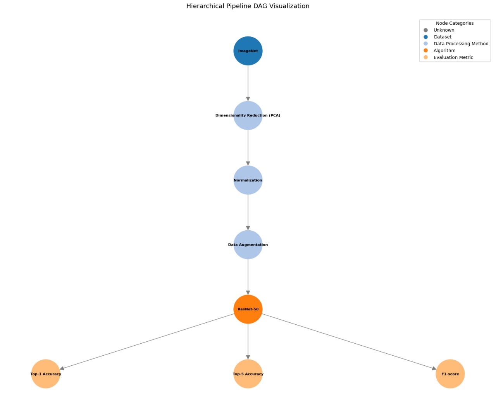

# 📊 Extract Data Analytics Pipeline from Research Papers using RAG & LLMs

This project automates the extraction of structured **data analytics pipelines** from research papers by combining **Retrieval-Augmented Generation (RAG)** and **Large Language Models (LLMs)**. It takes a paper's methodology section and outputs a structured **Directed Acyclic Graph (DAG)** in JSON format, suitable for meta-analysis and workflow replication.

> All logic is implemented in a single Jupyter Notebook for ease of exploration and reproducibility.

---

## 🚀 Features

- 🔍 **RAG-based retrieval** using FAISS + BM25 for context-aware summarization
- 🤖 **LLM-based summarization and DAG generation** using Hugging Face-hosted models
- 📈 Evaluation using **Graph Edit Distance (GED)** and **Levenshtein similarity**
- 📄 Includes a **synthetic benchmark dataset** of papers with reference pipelines
- 📊 Inline visualization of DAG structure and evaluation metrics

---

## 📁 Files Included

├── pipeline_extraction.ipynb # Main notebook with full pipeline
├── benchmark_dataset.csv # Synthetic paper titles and reference DAGs
├── example_pdfs/ # Sample input papers (optional)
├── .gitignore
└── README.md

---

## ⚙️ Requirements

- Python 3.10+
- Access to Hugging Face Hub (with API key)
- Packages:
  - `transformers`, `datasets`, `sentence-transformers`
  - `faiss`, `networkx`, `Levenshtein`
  - `matplotlib`, `numpy`, `pandas`, `PyPDF2`

Install with:
pip or !pip install in the notebook.

🔐 Hugging Face API Setup
This project uses models like T5, BART, Mistral, and LLaMA via Hugging Face. To access them:

Create an account at huggingface.co

Generate an access token here

Login in your notebook or terminal:
huggingface-cli login
from huggingface_hub import login
login("your-huggingface-token")

🧪 Running the Pipeline
Open the notebook:
jupyter notebook pipeline_extraction.ipynb

Then run cells in order. The pipeline will:

Read PDFs or synthetic papers

Extract methodology sections

Retrieve context with RAG

Generate summaries using LLMs

Produce a JSON DAG of the pipeline

Evaluate against reference pipelines using GED and Levenshtein similarity

Visualize results

📊 Sample Output
JSON DAG structure with nodes (datasets, preprocessing, models, metrics)

Evaluation chart showing GED and Levenshtein similarity

Matplotlib visual of pipeline steps

🖼️ Example DAG Output
Below is a visualization of an extracted data analytics pipeline, showing key components (e.g., dataset, preprocessing, algorithm, evaluation metric) and their dependencies.

  

The graph is auto-generated using networkx + matplotlib after parsing and structuring the methodology section.

📌 Notes
Large models are quantized or chunked to run under 16GB GPU (e.g., Kaggle or Colab)

Notebook includes post-processing to clean noisy JSON and ensure evaluation validity

LLaMA-based DAG generation is used for its structured output capabilities

📜 License
MIT License — see LICENSE for details.

🤝 Contributions
Feel free to open issues or pull requests if you’d like to extend or adapt this pipeline!
